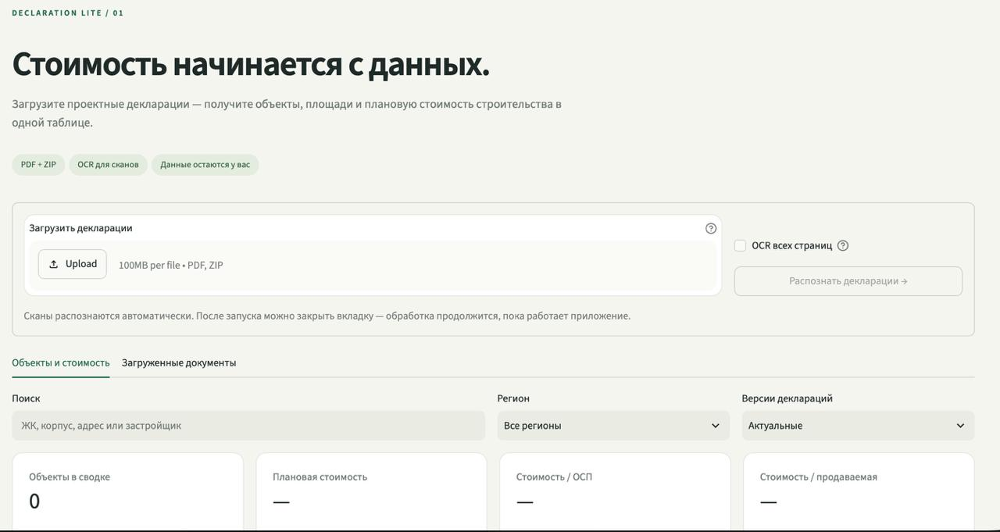
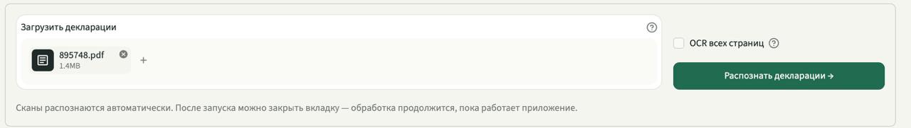
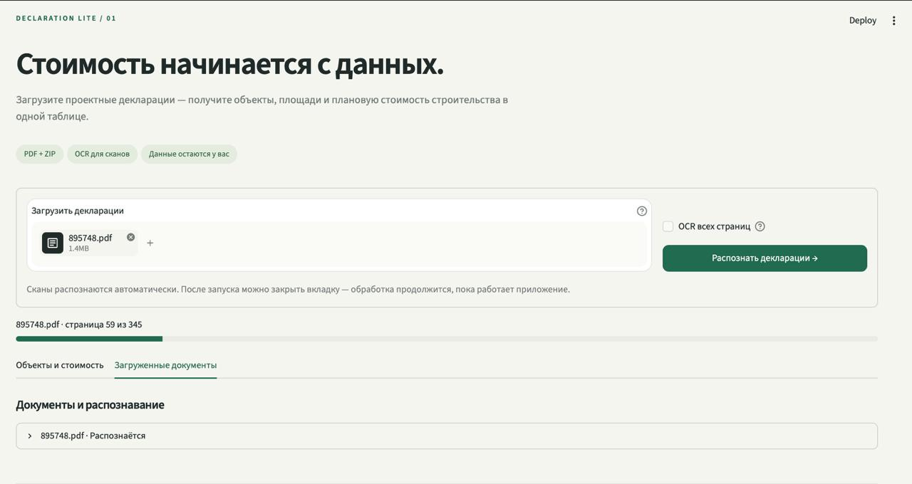
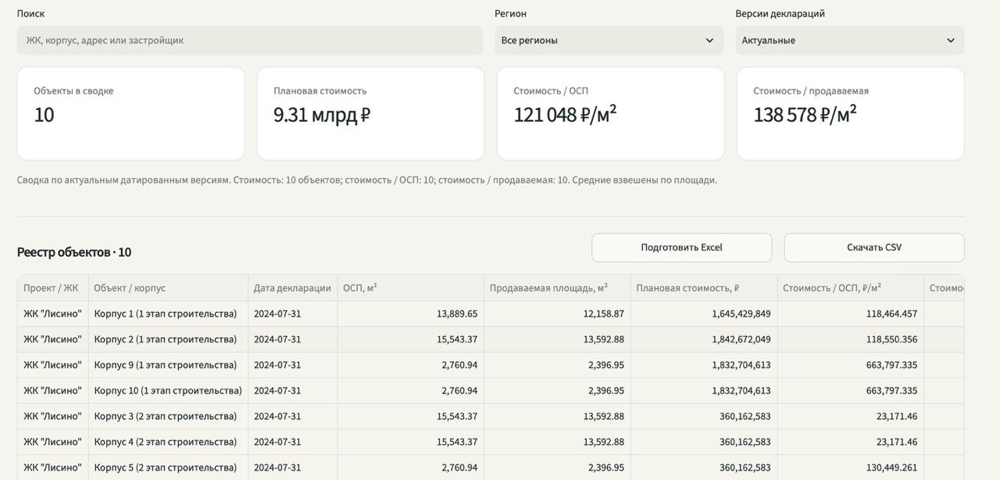
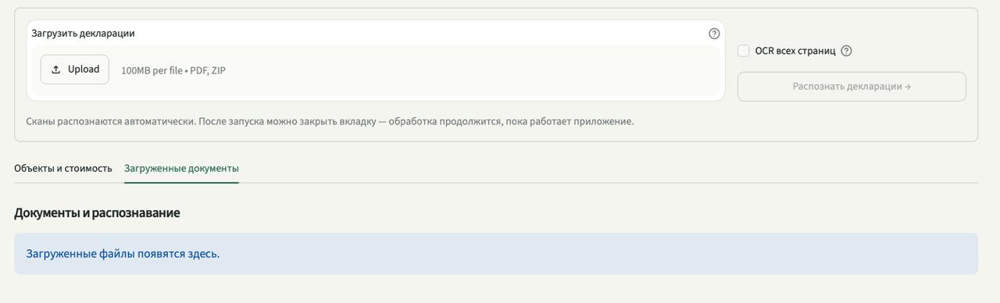

# Declaration Lite

**PDF проектной декларации → таблица объектов, площадей и стоимости строительства.**

Локальное приложение: загружаете PDF или ZIP с декларациями — получаете реестр корпусов с ОСП, продаваемой площадью, плановой стоимостью и стоимостью квадратного метра. Сканы распознаются встроенным OCR (`rus+eng`). Всё считается на вашей машине: без API-ключей, облака и внешних сервисов.



---

## Задача

Проектная декларация — это 150–350 страниц регламентированного текста. Ключевые цифры для оценки проекта (площадь здания, продаваемая площадь, плановая стоимость строительства) лежат в пронумерованных полях разделов 9 и 18, часто в таблицах, часто в сканах. Чтобы сравнить десять корпусов по ₽/м², аналитик вручную листает документы и переносит числа в Excel — это часы работы и источник ошибок.

Осложняющие факторы:

- в одном PDF несколько корпусов, поля нужно правильно привязать к «Объекту №N»;
- декларации переиздаются — нужна актуальная редакция, а не сумма всех версий;
- часть документов — сканы без текстового слоя;
- сумма без явной единицы измерения («1 234» — рубли или тысячи?) не должна попадать в расчёт.

## Решение

Детерминированный парсер по кодам полей + OCR-конвейер для сканов + реестр с версионированием. Без языковых моделей и без «додумывания» чисел: если значение не прочитано однозначно, ячейка остаётся пустой, а причина показывается рядом.

```
PDF/ZIP → валидация и дедупликация (SHA-256)
        → очередь в SQLite → фоновый worker
        → PyMuPDF: текст, шрифты, геометрия, таблицы
        → скан? → OpenCV (снятие линий таблицы) → Tesseract rus+eng
        → извлечение полей по кодам → привязка к «Объект №N»
        → нормализация единиц и проверки → расчёт ₽/м²
        → Streamlit: реестр, карточка объекта, Excel / CSV / JSON
```

Каждое значение хранится вместе с доказательством: код поля, подпись, исходная строка, номер страницы, метод чтения и координаты. В карточке объекта показывается страница PDF с выделенным фрагментом, из которого взято число.

## Как это выглядит

**1. Загрузка.** PDF или ZIP с пакетом деклараций, до 100 файлов за раз. Флажок «OCR всех страниц» — для PDF с повреждённым текстовым слоем.



**2. Обработка.** Очередь выполняется последовательно в фоновом процессе, прогресс — постранично. Вкладку браузера можно закрыть: обработка продолжится. Ошибка одного файла не останавливает остальные.



**3. Результат.** Сводка по актуальным редакциям и реестр объектов с поиском, фильтром по региону и переключением «Актуальные / Вся история». Выгрузка в CSV и Excel по текущим фильтрам.



**4. Диагностика.** По каждому документу — число объектов, страниц OCR, время обработки, предупреждения, выгрузка JSON и повторное распознавание.



## Что извлекается

| Показатель | Поле декларации |
|---|---|
| Номер и дата редакции | Заголовок документа |
| Застройщик, ИНН | 1.1.3 / 1.1.2, 2.1.1 |
| Объект / корпус, ЖК | 9.2.2, 10.6.1 |
| Регион, населённый пункт, адрес | 9.2.3, 9.2.6, 9.2.17 |
| Этажность | 9.2.19, 9.2.20 |
| ОСП — общая площадь здания | 9.2.21 |
| Площади жилых и нежилых помещений | 9.3.1, 9.3.2 |
| Продаваемая площадь | 9.3.3 |
| Плановая стоимость строительства | 18.1.1 |
| Разрешение на строительство, срок передачи | 11.1.1, 17.2.2 / 17.2.1 (в JSON) |

**Расчёты:** `Стоимость / ОСП = 18.1.1 ÷ 9.2.21`, `Стоимость / продаваемая = 18.1.1 ÷ 9.3.3`, `Доля продаваемой = 9.3.3 ÷ 9.2.21`. Сводные удельные показатели взвешены по площади (сумма стоимостей ÷ сумма площадей) и считаются только по объектам, где есть оба значения. Пропуски не превращаются в нули.

**Версионирование:** редакции группируются по номеру декларации и ИНН, актуальность определяется датой декларации. Новая редакция заменяет предыдущую целиком; конфликтующие версии одной даты и документы без даты видны в таблице, но в сводку не входят.

> Это плановые раскрытые значения, а не подтверждение фактической себестоимости строительства. Корректировки на класс, этажность и инфляцию не применяются.

## Структура

```text
app.py                       # интерфейс Streamlit: загрузка, реестр, карточка объекта
lite/parser.py               # извлечение полей, OCR, привязка к корпусам, расчёты
lite/storage.py              # SQLite, очередь, распаковка ZIP, дубликаты, редакции, сводка
lite/worker.py               # фоновая обработка с файловой блокировкой
lite/export.py               # Excel (3 листа) и CSV
lite/vendor/                 # низкоуровневые примитивы: геометрия PDF, нормализация русского текста
tests/                       # парсер, расчёты, OCR, экспорт, интерфейс (AppTest)
examples/                    # учебные PDF: текстовый и сканированный
Dockerfile / compose.yaml    # Python 3.12 + Tesseract rus/eng, непривилегированный пользователь
```

SQLite в режиме WAL, один рабочий процесс на каталог данных. Пользовательские имена файлов не используются как пути хранения, ZIP не распаковывается в файловую систему, строки экспорта защищены от интерпретации как формулы.

**Стек:** Python 3.12 · Streamlit · PyMuPDF · Tesseract (pytesseract) · OpenCV · pandas · SQLite · XlsxWriter · Docker.

## Запуск

Нужен только **Docker** — Python, Tesseract и все библиотеки ставятся внутрь контейнера автоматически. Вручную устанавливать ничего не требуется.

### Вариант 1 · GitHub Codespaces

Ничего не нужно ставить на компьютер, всё работает в браузере.

1. На странице репозитория: зелёная кнопка **Code** → вкладка **Codespaces** → **Create codespace on main**.
2. Когда откроется редактор, в терминале внизу выполните:
   ```bash
   docker compose up --build -d
   ```
   Первая сборка занимает 3–5 минут.
3. Внизу переключитесь на вкладку **PORTS**, найдите порт **8510** и нажмите иконку глобуса — приложение откроется в новой вкладке.

### Вариант 2 · На своём компьютере

1. Установите [Docker Desktop](https://www.docker.com/products/docker-desktop/) и запустите его. Дождитесь, пока значок кита перестанет мигать.
2. Скачайте репозиторий и откройте его папку в терминале.
3. Выполните:
   ```bash
   docker compose up --build -d
   ```
4. Откройте в браузере **http://localhost:8510**.

Подходит macOS (Intel и Apple Silicon), Windows с WSL 2 и Linux. Команда одна и та же.

### Проверка, что всё работает

Загрузите в приложение файл `examples/01_demo_text.pdf` из проекта. Ожидаемый результат: **2 корпуса**, стоимость **1 и 3 млрд ₽**, ОСП **10 000 и 20 000 м²**. Для проверки OCR — `examples/02_demo_scan.pdf` (те же данные, но сканом). Данные в примерах вымышленные.

### Управление

| Команда | Что делает |
|---|---|
| `docker compose ps` | статус: нужен `Up (healthy)` |
| `docker compose logs -f --tail=100` | логи приложения |
| `docker compose down` | остановить; загруженные документы сохраняются |
| `docker compose up -d` | запустить снова |
| `docker compose up --build -d` | пересобрать после изменения кода |

Если порт занят — создайте файл `.env` рядом с `compose.yaml` по образцу `.env.example` и укажите другой номер, например `APP_PORT=8511`. Адрес станет `http://localhost:8511`.

Данные хранятся в томе `declaration_data`. `docker compose down` его сохраняет. **`docker compose down -v` удаляет том вместе со всеми загруженными декларациями.**

<details>
<summary>Запуск без Docker (только для разработки)</summary>

Этот способ нужен, если вы правите код и хотите видеть изменения мгновенно. Для обычного запуска используйте Docker — он проще.

Tesseract ставится отдельно, Python-библиотека `pytesseract` его не устанавливает.

```bash
# macOS
brew install tesseract tesseract-lang

# Debian / Ubuntu
sudo apt install tesseract-ocr tesseract-ocr-rus tesseract-ocr-eng python3-venv

python3.12 -m venv .venv && source .venv/bin/activate
pip install -r requirements.txt
tesseract --list-langs        # в списке должны быть rus и eng
streamlit run app.py --server.port 8510
```

На Windows Tesseract нужно установить отдельно и добавить в `PATH`.

</details>

## Тесты

```bash
docker compose exec declarations python -m pytest -q -m "not ocr"
```

Полный набор, включая реальный OCR (медленнее):

```bash
docker compose exec declarations python -m pytest -q
```

Покрыты: разбор сумм и единиц измерения, разделение нескольких корпусов в одном документе, настоящий русский OCR растрового PDF, пустой и защищённый паролем PDF, ZIP с небезопасным путём, дедупликация по SHA-256, выбор актуальной редакции и конфликты дат, взвешенная сводка, экспорты, сценарии интерфейса через Streamlit AppTest, изоляция повреждённого файла в очереди.

## Ограничения

- PDF или ZIP с PDF; до 100 МБ на файл, 100 PDF и 500 МБ на пакет, 600 страниц на документ.
- Файлы с паролем и вложенные ZIP не поддерживаются.
- Качество на сканах зависит от разрешения и поворота страницы; рекомендуется электронный PDF или скан ~300 DPI. Исходная страница всегда доступна в карточке для проверки.
- Приложение локальное: порт открыт только на `127.0.0.1`, системы пользователей и ролей нет.
- Нет парсинга сайтов, автозагрузки деклараций и прогнозных моделей — только извлечение данных из загруженных документов.
